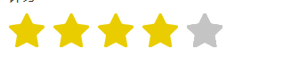

# 评价的星星

## 默认展示效果



## 使用方法


```
    <div id="evaluate"></div>
    
    
    <script src="js/jquery.star.raty.js"></script>
    <script>
    starRaty({
        selector:'#evaluate',
        score:'5',
        operable:false
    });
    
    
    </script>
    
  
```

## 参数说明


参数      | 默认值     |    说明      |    格式
----------|--------------|--------------|--------------
selector  | 无           | 选择器       | string '#id','.class'
score     | 无           |  1-5的分值   | number 1-5
float     | 'none'       | 浮动         | string 'left' , 'right'
position  | 'relative'   | 定位         | strging 'absolute' ,'relative'
starMargin| 'auto'       |  margin值    | string '0 0 0 0' ，按照css中的margin格式设置
operable  | false        | 是否可操作   | string true, false
star   | 默认图片对象属性  |      默认图片对象属性       | 


- star  ---{}
     - star.type ---------------可选值 'img' ,'font', 默认为 'font'
    - star.fontPath ---------- 当star.type为 'font'时 生效
    - star.light ------------- 当star.type为 'font'时，表示字体图标的类名；当star.type为 'img'时，其表示路径
    - star.dark -------------- 当star.type为 'font'时，表示字体图标的类名；当star.type为 'img'时，其表示路径
    - star.lightColor -------- 当star.type为 'font'时 生效 ,格式同css颜色表示
    - star.darkColor ---------当star.type为 'font'时 生效 ,格式同css颜色表示
    - star.fontSize ----------当star.type为 'font'时 生效 ,格式同css颜色表示
    - star.height ------------当star.type为 'img'时 生效 ,格式同css高度表示宽度表示
    


